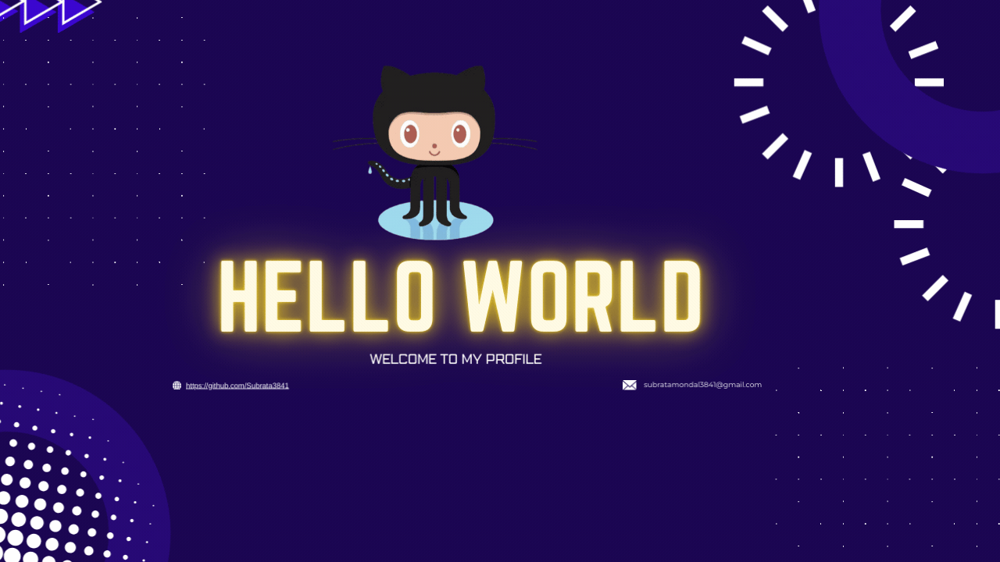

<!-- Banner Image -->

    
  

  
<h1 align="center">Hi 👋, I'M SUBRATA</h1>
<h3 align="center">An enthusiastic Software Engineer dedicated to crafting innovative solutions, hailing from the heart of INDIA</h3>

 

  

- 👨‍💻 All of my projects are available at [https://github.com/Subrata3841](https://github.com/Subrata3841)

- 📫 How to reach me **subratamondal3841@gmail.com**

<!-- <h3 align="left">Connect with me:</h3>

 -->

<h3 align="left">Languages and Tools:</h3>

                 

<!--Github stats Table--> 
<h2 align="center">📊 Gɪᴛʜᴜʙ Sᴛᴀᴛs 📊</h2>

<table width="100%">
  <tr>
    <td width="50%">
      <h3 align="center"><strong>Top Languages</strong></h3>
      

        
      

    </td>
    <td width="50%">
      <h3 align="center"><strong>GitHub Stats</strong></h3>
      

        
      

    </td>
  </tr>
  <tr>
    <td colspan="2">
      <h3 align="center"><strong>Streak Stats</strong></h3>
      

        
      

    </td>
  </tr>
</table>
 
<!--Contact Section--> 

<h2 align="center">🤝 Cᴏɴɴᴇᴄᴛ Wɪᴛʜ Mᴇ 🤝 </h2>

  

 

<!--Buy me a coffee-->

<!--Footer--> 

  

